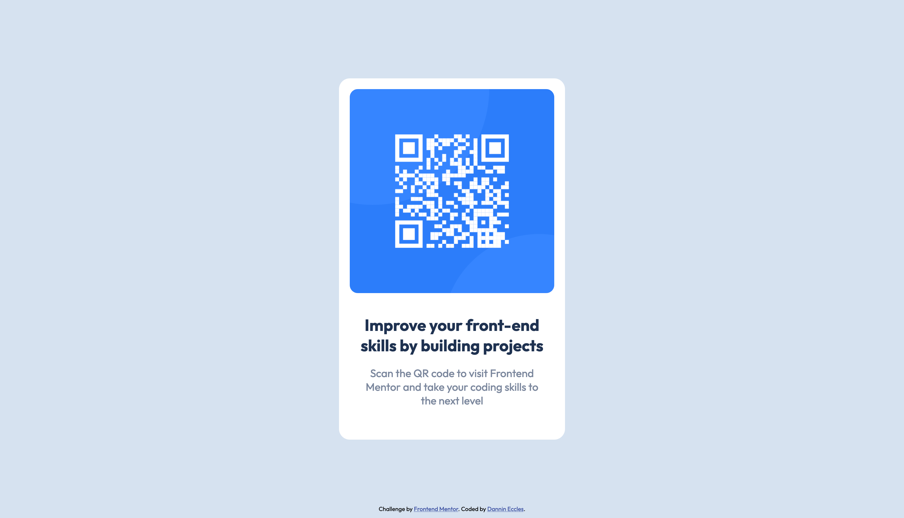

# Frontend Mentor - QR code component solution

This is a solution to the [QR code component challenge on Frontend Mentor](https://www.frontendmentor.io/challenges/qr-code-component-iux_sIO_H). 
Frontend Mentor challenges help you improve your frontend coding skills by building realistic projects. 

## Table of contents

- [Overview](#overview)
  - [Screenshot](#screenshot)
  - [Links](#links)
- [My process](#my-process)
  - [Built with](#built-with)
  - [What I learned](#what-i-learned)
  - [Continued development](#continued-development)
- [Author](#author)

## Overview

### Screenshot

### Links

- Solution URL: [QR Code Component](https://qr-code-component-main-dannineccles.vercel.app/)

## My process

### Built with

- Semantic HTML5 markup
- CSS custom properties

### What I learned

This project was a great way to refresh my knowledge of html and css and a rather
long hiatus.

### Continued development

For my next Frontend Mentor challenge, I'm hoping to re-familiarize myself
with CSS Grid.

## Author

- Linkedin - [Dannin Eccles](https://www.linkedin.com/in/dannin-eccles/)
- Frontend Mentor - [@DanninEccles](https://www.frontendmentor.io/profile/DanninEccles)